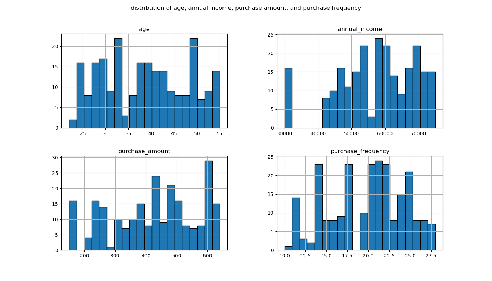
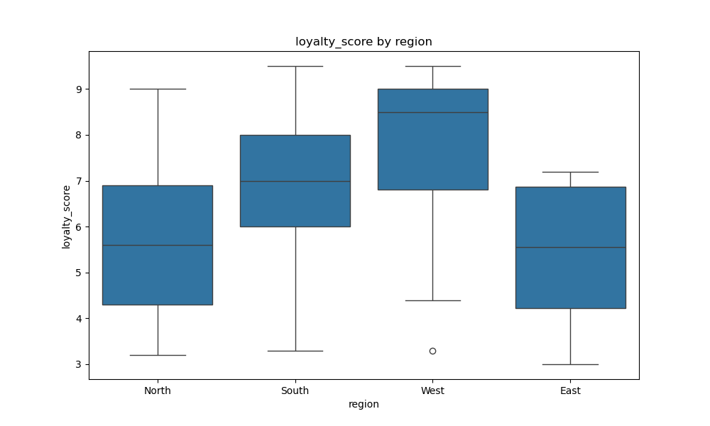
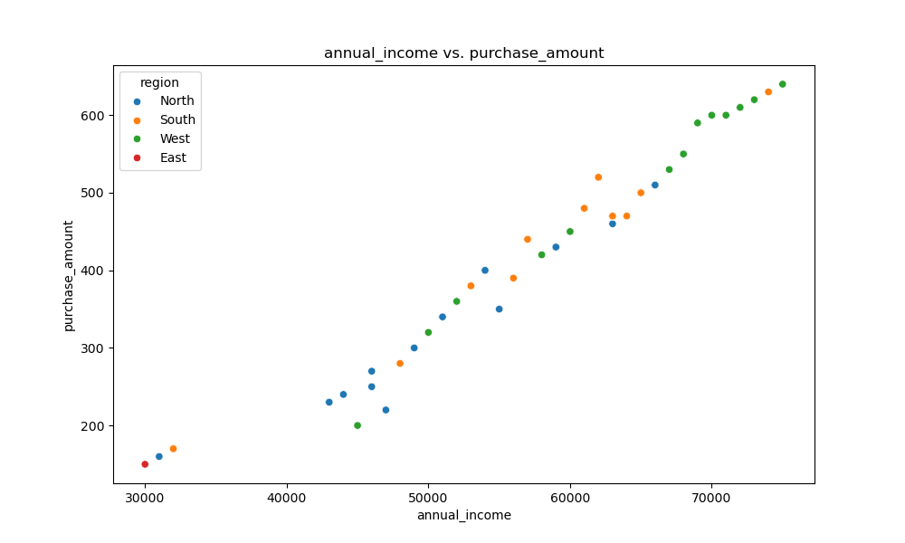
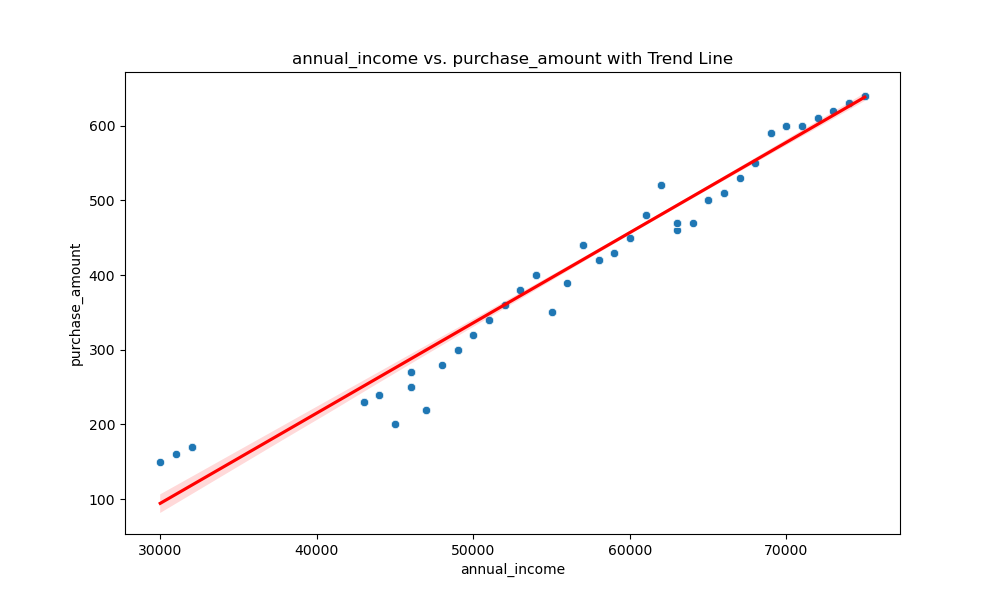
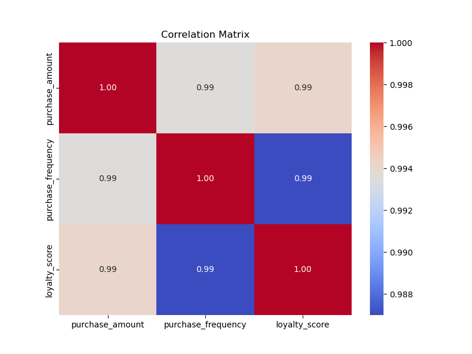
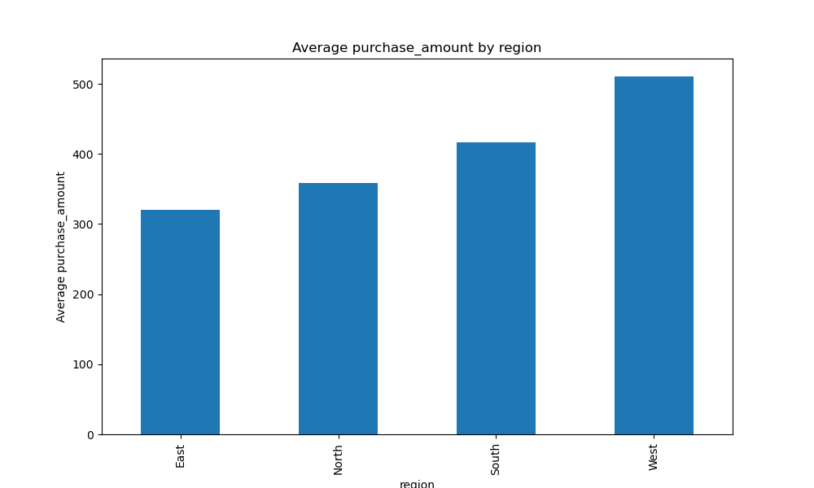

[](https://github.com/nogibjj/Mobasserul_Haque_MiniProject1/actions/workflows/cicd.yml)

Pandas Descriptive Script mini Project
# Source

Customer Purchasing Behaviors
url : https://www.kaggle.com/datasets/hanaksoy/customer-purchasing-behaviors

# About Dataset:

### Dataset Columns

- **customer_id**: Unique ID of the customer.
- **age**: The age of the customer.
- **annual_income**: The customer's annual income (in USD).
- **purchase_amount**: The total amount of purchases made by the customer (in USD).
- **purchase_frequency**: Frequency of customer purchases (number of times per year).
- **region**: The region where the customer lives (North, South, East, West).
- **loyalty_score**: Customer's loyalty score (a value between 0-100).


This dataset includes information on customer profiles and their purchasing behaviors. The data features columns for user ID, age, annual income, purchase amount, loyalty score (categorized into classes), region, and purchase frequency. It is intended for analyzing customer segmentation and loyalty trends, and can be used for various machine learning and data analysis tasks related to customer behavior and market research.

# Data Visualization














## Running Tests

To run the tests, use the following command:

```bash
python -m unittest test_main.py
