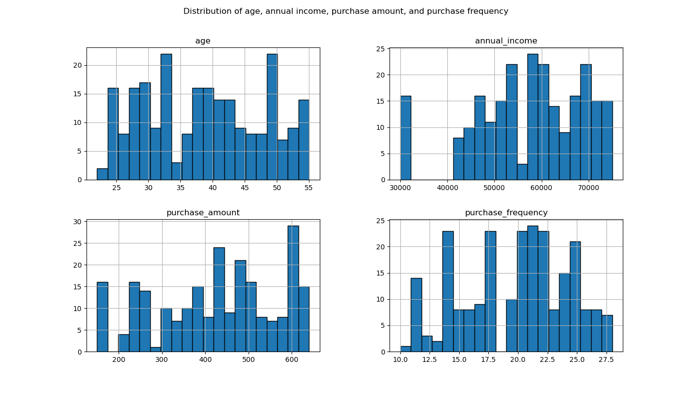
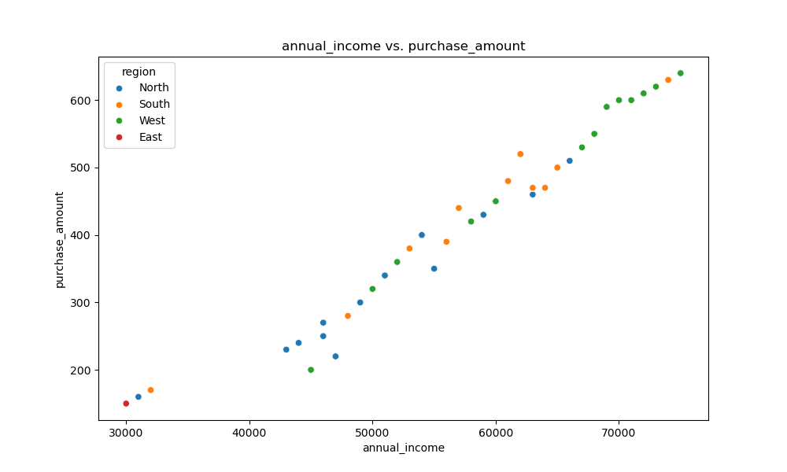
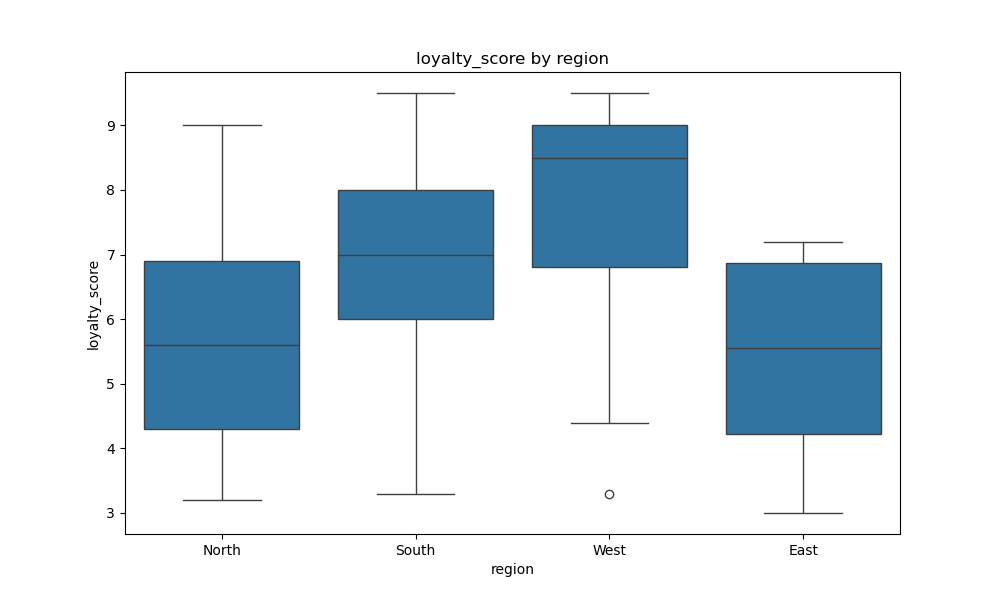
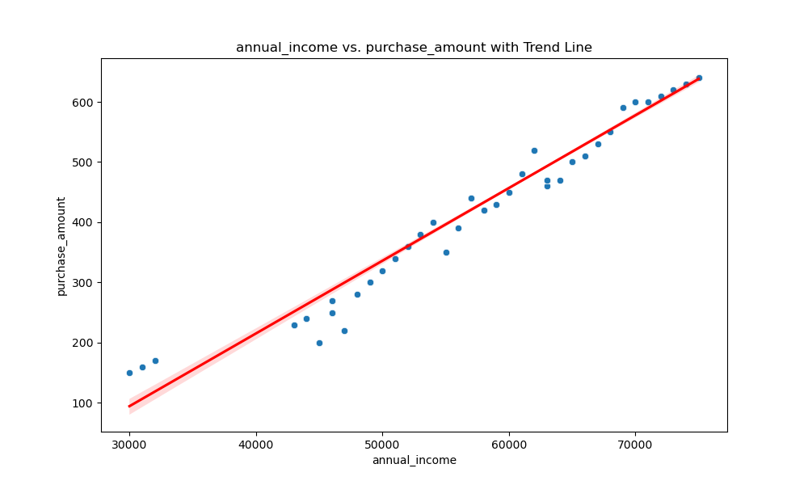

# Summary Report

# Summary Statistics
|                    |   count |        mean |         std |   min |      25% |     50% |       75% |     max |   median |   range |        variance |
|:-------------------|--------:|------------:|------------:|------:|---------:|--------:|----------:|--------:|---------:|--------:|----------------:|
| user_id            |     238 |   119.5     |    68.8489  |     1 |    60.25 |   119.5 |   178.75  |   238   |    119.5 |   237   |  4740.17        |
| age                |     238 |    38.6765  |     9.35112 |    22 |    31    |    39   |    46.75  |    55   |     39   |    33   |    87.4434      |
| annual_income      |     238 | 57407.6     | 11403.9     | 30000 | 50000    | 59000   | 66750     | 75000   |  59000   | 45000   |     1.30048e+08 |
| purchase_amount    |     238 |   425.63    |   140.052   |   150 |   320    |   440   |   527.5   |   640   |    440   |   490   | 19614.6         |
| loyalty_score      |     238 |     6.79412 |     1.89905 |     3 |     5.5  |     7   |     8.275 |     9.5 |      7   |     6.5 |     3.60638     |
| purchase_frequency |     238 |    19.7983  |     4.56288 |    10 |    17    |    20   |    23     |    28   |     20   |    18   |    20.8199      |

## Histograms

## annual_income vs purchase_amount by region

## loyalty_score by region

## Correlation Heatmap

## annual_income vs purchase_amount with Trend Line

## Average purchase_amount by region

